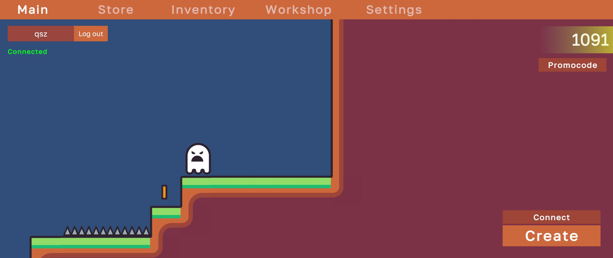
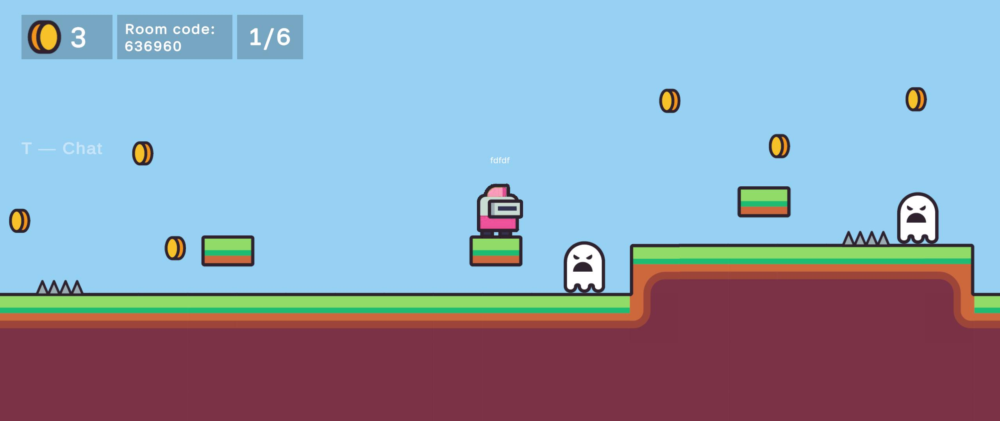
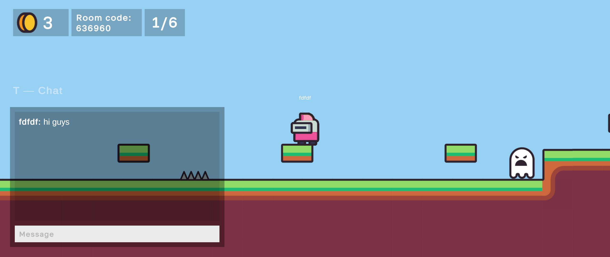

# Spike & Run

**Spike & Run** is a multiplayer 2D platformer made in Unity. Players create or join rooms, run through procedurally generated terrain, collect coins, avoid spikes and enemies, unlock skins, chat in-game, and customize their character.

Play it on itch.io: https://mosvic-games.itch.io/spike-and-run

## Screenshots

## Features

- Online multiplayer rooms with Photon PUN2
- Procedural 2D platformer level generation
- Coins, shop, inventory, promocodes, and workshop skin creation
- Runtime sprite-based animation without Animator state machines
- Custom recolored skins synced across the network
- In-game chat and room codes
- English/Russian localization
- Menu music, SFX, jump and walking sounds with distance falloff

## Tech Stack

- Unity 6.3 LTS
- C#
- Photon PUN2
- TextMeshPro
- Unity Localization
- macOS development on Mac mini M4

## Setup

This public repository is sanitized before upload. To run multiplayer/account features locally, configure these placeholders:

- `Assets/Photon/PhotonUnityNetworking/Resources/PhotonServerSettings.asset`
  - `AppIdRealtime: YOUR_PHOTON_APP_ID_HERE`
- `Assets/AccountLoginUI.cs`
  - `accountServerUrl: YOUR_ACCOUNT_SERVER_URL_HERE`
- `Assets/2D Platformer/Scenes/Menu.unity`
  - `accountServerUrl: YOUR_ACCOUNT_SERVER_URL_HERE`

Open the project in Unity 6.3, restore your Photon App ID, and press Play from `Assets/2D Platformer/Scenes/Menu.unity`.

## Scenes

- `Menu` - main menu, store, inventory, workshop, settings, account panel
- `GameScene` - multiplayer gameplay, level generation, chat, pause menu

## Builds

The project includes helper tooling for itch.io release builds:

- Unity menu: `Build -> Itch -> Build Windows Release`
- Unity menu: `Build -> Itch -> Build macOS Release`
- Packaging script: `Tools/package_itch.sh`

Final public builds are uploaded separately to itch.io, not committed to Git.
